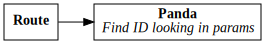
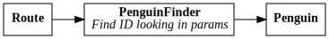
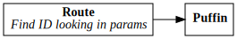

React Router Patterns
=====================

Depending on your code organization, you may (or may not!) wish to have a
component tied to routing.

This app shows three possibilities, each one tied to presenting a list of
animals.

Pandas
------

Pandas are routed simply and the `Panda` component mixes together both the
finding of the right id from the routing params, along with the presentation.
This can be a good pattern for smaller/simpler apps, where the `Panda`
component won't need to be re-used in other places.

Testing the `Panda` component does require that you mock a router, since
the component cannot be used outside of routing.

Penguins
--------

Penguins are routed simply—but not to the `Penguin` component! Instead, they
are routed to the `PenguinFinder` component, which is a simple logical
component with no presentation: it finds the id via the routing params, and
renders the simple, pure-presentational `Penguin` component.

This allows you to use `Penguin` in other places, separating the
routing-specific task of finding the id from the presentation.

Testing the `Penguin` presentational component is now simple.

Puffins
-------

Puffins are routed with a more complex feature—using the `render` attribute
on their route. This is passed the `match`, `location`, and `history` props.
Here, the routing itself finds the `match.params.id` with the id of the puffin
to render, and renders the simple, presentational component by directly passing
it a prop with the puffin to render.

Similar to penguins, this lets us use the `Puffin` component in other places,
separating the routing-specific task of finding the id from the presentation.
It does it with a different approach, though—instead of putting that logic
in a wrapper "PuffinFinder" component, it puts that logic in the route itself.

Testing the `Puffin` presentational component is now simple.
